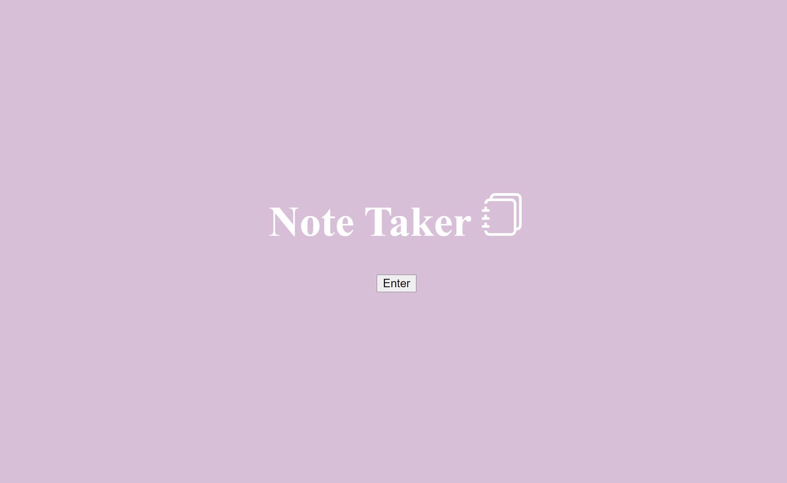
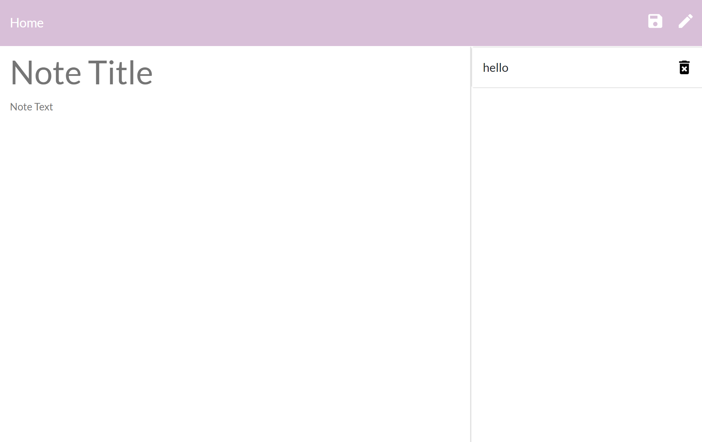

# NoteTaker

## Description

## Table of Contents

* [Installation](#installation)
* [License](#license)
* [Contributing](#contributing)
* [Tests](#tests)
* [Questions](#questions)

## Installation

...
npm install
...

## License

## Contributing

Maya Chisem

## Tests

In order to run tests, run the following command:

...
npm test
...

## Questions

Questions? Contact me on Github at mchisem or by email at chisem.maya@gmail.com

https://mchisem.github.io/NoteTaker/develop/public/index.html
